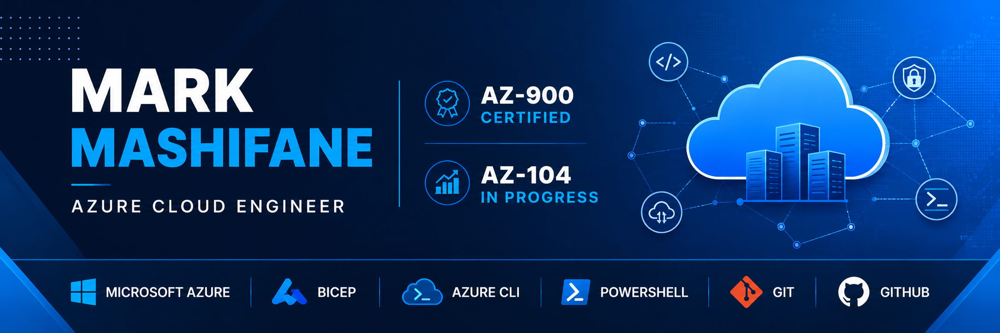

  

# Hi there 👋 I'm Mark Mashifane

# ☁️ Microsoft Certified Azure Administrator Associate (AZ-104)

Cloud Engineer passionate about designing, deploying, securing and automating Microsoft Azure environments using Infrastructure as Code, automation and enterprise cloud best practices.

I enjoy building real-world Azure projects that demonstrate practical cloud engineering skills while continuously expanding my knowledge of Azure, DevOps and Infrastructure Automation.

---

# 🚀 About Me

🎓 BCom Entrepreneurship Graduate

☁️ Microsoft Certified Azure Administrator Associate (AZ-104)

☁️ Microsoft Certified Azure Fundamentals (AZ-900)

💻 Passionate about Microsoft Azure Cloud Engineering

⚙️ Infrastructure as Code enthusiast

🌍 Based in South Africa

🎯 Currently pursuing opportunities as a:

- Junior Cloud Engineer
- Azure Administrator
- Cloud Infrastructure Engineer
- Cloud Support Engineer

---

# 🏆 Microsoft Certifications

## Microsoft Certified: Azure Administrator Associate (AZ-104)

Successfully completed Microsoft's Azure Administrator certification covering:

- Azure Identity & Governance
- Azure Storage Administration
- Azure Compute
- Azure Virtual Networking
- Azure Monitoring
- Backup & Recovery
- Azure Resource Management

---

## Microsoft Certified: Azure Fundamentals (AZ-900)

Foundation knowledge of:

- Cloud Concepts
- Azure Services
- Azure Pricing
- Azure Governance

---

# ☁️ Enterprise Azure Portfolio

## Infrastructure as Code

- Azure Enterprise Bicep Infrastructure as Code

---

## Enterprise Architecture

- Azure Landing Zone

---

## Networking

- Azure Enterprise Networking

---

## Identity & Security

- Azure Identity & RBAC

- Azure Policy & Governance

---

## Compute

- Azure Compute Administration

---

## Storage

- Azure Storage Administration

---

## Monitoring

- Azure Monitoring Solutions

---

## Business Continuity

- Azure Backup & Disaster Recovery

---

## Cost Optimization

- Azure Cost Management

---

## Automation

- Azure Automation using PowerShell & Azure CLI

---

# 💻 Technical Skills

## Microsoft Azure

- Azure Virtual Machines
- Azure Storage
- Azure Virtual Networks
- Azure Monitor
- Azure Backup
- Azure Policy
- Azure RBAC
- Microsoft Entra ID
- Azure Resource Manager
- Azure Landing Zones

---

## Infrastructure as Code

- Azure Bicep
- ARM Templates

---

## Automation

- Azure CLI
- PowerShell

---

## Version Control

- Git
- GitHub

---

## Operating Systems

- Windows Server

---

# 📂 Featured Enterprise Projects

| Project | Technologies |
|----------|--------------|
| Azure Enterprise Bicep IaC | Azure Bicep • Azure CLI • PowerShell |
| Azure Landing Zone | Azure Governance • CAF |
| Azure Enterprise Networking | VNets • NSGs • Bastion |
| Azure Identity & RBAC | Microsoft Entra ID • RBAC |
| Azure Storage Administration | Storage Accounts • Blob Storage |
| Azure Compute Administration | Azure Virtual Machines |
| Azure Monitoring Solutions | Azure Monitor • Log Analytics |
| Azure Backup & Disaster Recovery | Recovery Services Vault |
| Azure Cost Management | Cost Optimization |
| Azure Automation | Azure CLI • PowerShell |

---

# 📈 Current Learning Journey

After completing **AZ-104**, I am expanding my cloud engineering skills through:

- GitHub Actions
- Azure DevOps
- Terraform
- Azure Key Vault
- Managed Identities
- Private Endpoints
- Azure Kubernetes Service (AKS)
- CI/CD Pipelines

---

# 📫 Let's Connect

## GitHub

https://github.com/markmashifane

---

## LinkedIn

https://linkedin.com/in/markmashifane

---

## Email

phokengmk@gmail.com

---

# 🎯 Career Objective

My goal is to build secure, scalable and automated Microsoft Azure environments while contributing to enterprise cloud solutions as a Cloud Engineer.

I am particularly interested in opportunities involving:

- Cloud Infrastructure
- Azure Administration
- Infrastructure as Code
- Cloud Automation
- DevOps
- Enterprise Cloud Architecture

---

# 🌟 Philosophy

> "Continuous learning, automation and building reliable cloud solutions one deployment at a time."

---

⭐ **If you find my projects interesting, feel free to explore my repositories and connect with me on LinkedIn.**
